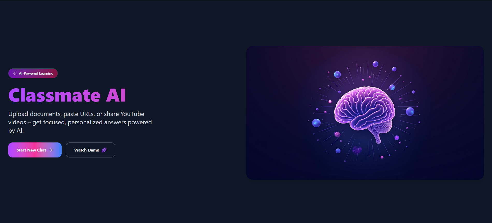
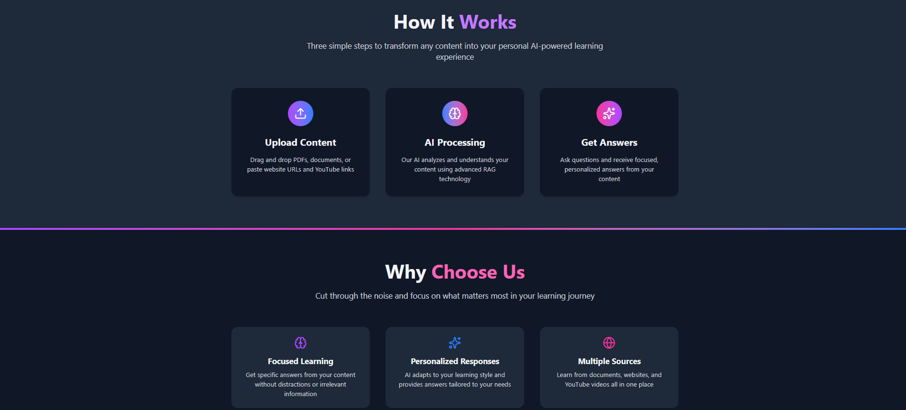
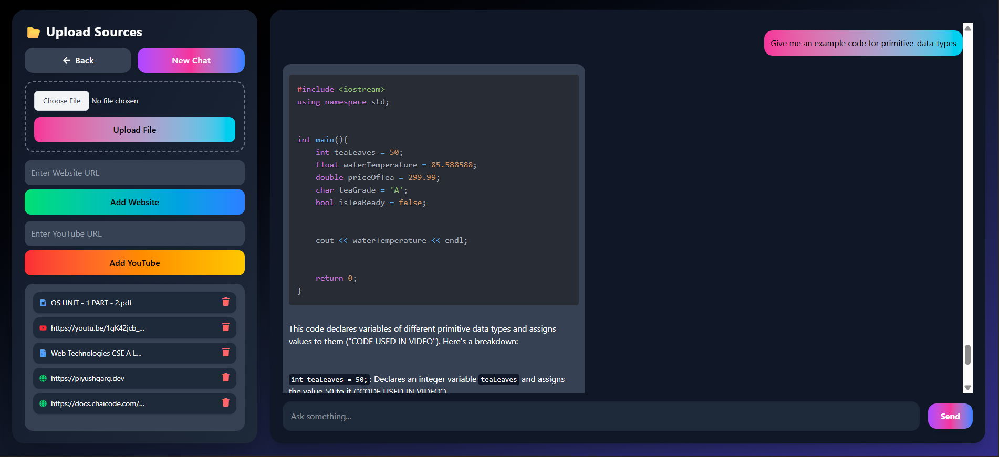

# 🎓 Classmate AI  

**Classmate AI** is an interactive **chat-based application** where users can upload **documents, websites, or YouTube videos** as knowledge sources, and then ask **questions in natural language**.  

The system uses **Retrieval-Augmented Generation (RAG)** to fetch relevant context from the uploaded sources and generate intelligent responses.  

Think of it like having your very own **AI-powered study buddy** — ask questions, and it answers using your uploaded materials.  

---

## 🚀 Features
- 💬 **Chat with AI** – ask natural questions and get answers grounded in your own data.  
- 📂 **Upload Knowledge Sources** – PDFs, Websites, and YouTube transcripts.  
- 🔍 **RAG-based Querying** – fetches the most relevant chunks for accurate answers.  
- 📝 **Source Citations** – see exactly which documents were used.  
- 🎨 **Beautiful UI** – clean, responsive, and with markdown + code highlighting.  
- 🔔 **Toast Notifications** – smooth feedback for uploads, errors, and actions.  
- ⚡ **Real-time Updates** – optimistic updates and loading spinners for smooth UX.  

---

## 🛠️ Tech Stack  

### **Frontend**
- ⚛️ React + Vite  
- 🎨 TailwindCSS + Framer Motion (animations)  
- 📦 React Markdown + Syntax Highlighter (clean code rendering)  
- 🔔 React Toastify (toast notifications)  

### **Backend**
- 🟢 Node.js + Express.js  
- 🗄️ MongoDB + Mongoose (for sessions, messages, and sources)  

### **AI & Vector Database**
- 🤖 Gemini (LLM for intelligent responses)  
- 📂 Qdrant (Vector DB for embeddings & retrieval)  
- 🔍 Embeddings via Gemini  (or similar)  

---

## 🏗️ High-Level Architecture  

1. **User Uploads a Source**  
   - File (PDF), Website, or YouTube link is processed.  
   - Content is chunked & embedded → stored in **Qdrant vector DB**.  

2. **User Asks a Question**  
   - Query is embedded.  
   - Qdrant retrieves most relevant chunks.  

3. **RAG Pipeline**  
   - Retrieved context + user query are sent to the LLM.  
   - AI generates a **grounded response** with citations.  

4. **Frontend Display**  
   - Messages appear in a chat interface.  
   - Markdown is rendered with **code highlighting & scrollable blocks**.  

---

## ⚡ Getting Started  

Follow these steps to run the project locally:  

---

### 🔹 Step 1: Clone the Repository
```bash
git clone https://github.com/your-username/classmate_ai.git
```
### 🔹 Step 2: Backend Setup
```bash
cd backend
npm install
```
Create .env file inside /backend: use your own URL's and API keys
```env
PORT=5000
MONGO_URI=your_mongodb_uri
OPENAI_API_KEY=your_openai_key
QDRANT_URL=http://localhost:6333
QDRANT_API_KEY=your_qdrant_api_key
```
Run backend server:
```bash
npm run dev
```
### 🔹 Step 3: Frontend Setup
```bash
cd frontend
npm install
```
Create .env file inside /frontend:
```bash
VITE_API_URL=http://localhost:5000
```
Run frontend app:
```bash
npm run dev
```
### 🔹 Step 4: Run Qdrant (Vector DB)
```bash
docker run -p 6333:6333 qdrant/qdrant
```
Qdrant UI will be available at 👉 http://localhost:6333/dashboard

### Screenshots

### Landing Pages



### Chat and Upload Interface
